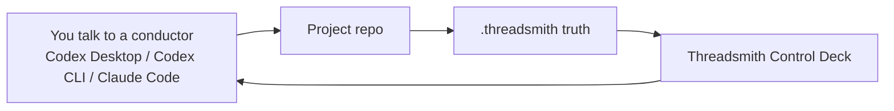
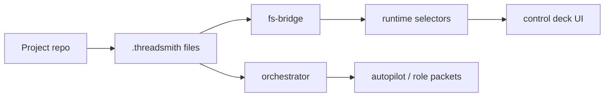

# Threadsmith

[](LICENSE)


> Threadsmith is a local control deck for long-running AI coding work.
> It moves project truth out of the chat fog and into a durable `.threadsmith/` workspace.

Threadsmith 是一个面向 vibe coding / agentic coding 的 **local web control deck**。

它不替代 Codex Desktop、Codex CLI、Claude Code 或你的主聊天入口。你仍然在 conductor surface 里对话和开发；Threadsmith 站在旁边，把项目目标、当前阶段、执行记录、证据、验收状态、上下文 packet 和角色路由整理成一个可看的控制台。

如果你遇到过这些问题，Threadsmith 就是为这个场景做的：

- 聊天线程越来越长，AI 开始顺着旧结论说话。
- 项目到底做到哪一步、验收到哪一关，只能靠翻历史消息。
- 每轮都要重复贴背景、贴计划、贴 Done when，token 消耗很高。
- 多角色协作看起来很酷，但缺少一个稳定的 truth source。
- 代码已经改了，证据和 closeout 却没有沉淀下来。


## 你会得到什么

- **Truth-first project state**: `.threadsmith/` 保存 Project Brief、Current Phase、Acceptance State、roadmap、runs、events、evidence 和 closeout。
- **Context OS**: Context Packet、Repo Map、Evidence Summary、Context Budget Ledger 和 Role Packets 把长线程压成角色可用的紧凑上下文。
- **Lower token drag**: 角色优先读取最新 packet 和 committed truth，而不是重放整段聊天历史。
- **Single-screen supervision**: 首页用五块信息展示当前命令、项目地图、推进判断、协作现场和验收雷达。
- **Skill Orchestrator foundation**: v0.3.0 可以发现本地 Codex skills、解释 route health，并在缺少外部 skill 时回退到内置 mini protocols。
- **Risk-aware decision support**: 对 release、public claim、跳过验证、大架构改动等高成本决策显示 advisory `critical-decision-review` 建议，但不做隐藏自动执行或 blocking gate。
- **Codex-first autopilot**: 支持连续推进 locked phase，并在 accepted、paused、需要用户决策或命中 stop condition 时停下。
- **Local-first web app**: 本地运行，读取你自己的项目目录；没有托管后端要求。
- **macOS / Windows launchers**: 提供 `.command` 和 `.ps1` 快捷入口。

## 它如何接入你的开发流



一句话心智模型：

- **Conductor** 负责聊天、判断、写代码和发起动作。
- **Threadsmith** 负责显示、校准、监督和保留 durable truth。
- **`.threadsmith/`** 是跨线程、跨天、跨角色的项目状态源。

## 快速开始

### 1. 克隆并安装

```bash
git clone https://github.com/Teddy-creator/Threadsmith-control-deck.git
cd Threadsmith-control-deck
npm ci
```

要求：

- Node.js `22+`
- npm `11+`

### 2. 启动本地控制台

```bash
npm run start
```

打开：

```text
http://127.0.0.1:5173/?appHome=1
```

如果 `5173` 被占用：

```bash
npm run dev --workspace @threadsmith/control-deck -- --host 127.0.0.1 --port 5174
```

然后打开：

```text
http://127.0.0.1:5174/?appHome=1
```

### 3. 使用平台启动器

macOS：

```bash
./Open-Threadsmith-App.command
```

Windows PowerShell：

```powershell
.\Open-Threadsmith-App.ps1
```

如果你已经知道要直达哪个项目：

```bash
./Launch-Threadsmith.command "/path/to/your-project"
```

```powershell
.\Launch-Threadsmith.ps1 "C:\path\to\your-project"
```

### 4. 连接真实项目

第一次进入后：

1. 打开 `项目与来源`。
2. 选择或输入真实项目根目录。
3. 如果项目还没有 `.threadsmith/`，点击初始化。
4. 回到首页，确认 Project Brief、Current Phase、Acceptance State 已出现。

Demo mode 只用于理解页面，不代表真实项目进度。正式开发时请连接你的真实项目目录。

## 安装 `$threadsmith` Codex Skill

如果你希望 Codex Desktop 能显式调用 `$threadsmith`，把仓库里的 skill 安装到本机 Codex skills 目录：

```bash
mkdir -p ~/.codex/skills/threadsmith
cp -R codex/skills/threadsmith/. ~/.codex/skills/threadsmith/
```

如果你已经手动改过全局 skill，覆盖前先备份：

```bash
cp -R ~/.codex/skills/threadsmith ~/.codex/skills/threadsmith.backup
```

安装后重启 Codex Desktop 或开启新会话，让 skill 列表重新加载。

常用同步指令：

```text
使用 $threadsmith，先同步当前项目状态，不开始实现，只汇报 current phase / acceptance / next best step。
```

常用推进指令：

```text
使用 $threadsmith，按当前 Project Brief / Current Phase / Acceptance State 推进下一刀。
```

连续推进当前 locked phase：

```text
使用 $threadsmith，连续推进当前 phase，直到 accepted、paused、需要我决策、或遇到安全 stop condition。
```

CLI autopilot continuation:

```bash
npm run threadsmith:autopilot -- continue "/path/to/your-project"
```

## 日常工作流

推荐日常路径：

1. 打开 Threadsmith，确认当前连接的是正确项目。
2. 看首页五块：当前命令、项目地图、推进判断、协作现场、验收雷达。
3. 回到 Codex Desktop、Codex CLI 或其他 conductor surface 继续主要开发对话。
4. 在 phase 开始/结束、方向改变、验证变化、失败恢复、closeout 或准备提交时调用 `$threadsmith` 或明确要求写回 `.threadsmith/`。
5. 回到 Threadsmith 点击刷新，确认 phase、run、evidence、acceptance 是否真的更新。

不需要每句话都调用 `$threadsmith`。普通讨论、临时想法、短问题可以正常聊天；只有会影响 durable project truth 的内容才需要写回。

## 核心概念

### `.threadsmith/`

项目里的 durable truth 文件夹。Threadsmith 页面和 `$threadsmith` skill 都围绕它工作。它不是聊天记录，而是项目状态、阶段、证据和验收的长期记忆。

### Context Packet：上下文包

当前项目上下文的紧凑版本。它把背景、当前阶段、证据、风险和下一步压成模型更容易消费的结构，减少长线程带来的 token drag 和 stale reasoning。

### Role Packets：角色上下文包

给 planner、executor、reviewer、verifier、closeout 等角色看的专属上下文。每个角色只拿自己需要的输入、输出要求、guardrails 和 stop condition。

### Built-in Mini Protocols：内置小协议

v0.3.0 内置 `brief`、`plan`、`debug`、`review`、`verify`、`closeout`、`handoff`、`recover`、`research` 等小协议。它们是 fallback kernel，不依赖用户本机一定安装了外部 skills。

### Skill Orchestrator：技能编排器

Threadsmith 可以发现本地 Codex skills，并把 route decision 写成可解释的 workflow metadata。当前版本不会自动执行任意外部 skill；它会在不可用时回退到内置 mini protocol。

### Risk Review：关键决策审查提示

Threadsmith 会对高成本承诺给出 advisory risk-review signal，例如发布、公开宣传、跳过验证、大改架构、provider/tooling 变更或破坏性操作。这个信号可以建议你显式调用 `critical-decision-review`，也会进入 role packets 和 command bridge route artifacts。

它不是隐藏自动执行，也不是 blocking gate。低风险、可逆、证据充分的小改动应该继续按普通 workflow 推进，不应该被仪式化反对拖慢。

## 当前状态

Latest stable release: `v0.3.0 Harness Skill Orchestrator`.

当前稳定能力：

- Codex-first workflow supervision
- `.threadsmith` truth read/write
- Context OS artifacts
- role packet generation
- skill routing metadata
- advisory risk-review route metadata
- built-in mini protocol fallback
- safer autopilot continuation
- Windows and macOS launcher parity

明确不承诺：

- 原生桌面 app 打包
- 托管后端、云同步、RAG 或 embeddings
- 完整替代主聊天入口
- 任意 provider 的全自动 multi-provider 执行
- 自动执行任意外部 skill

## 架构

```text
apps/control-deck/     Local web control deck and bridge server
packages/domain/       Shared schema and core state objects
packages/fs-bridge/    .threadsmith file IO and truth bridge
packages/runtime/      Supervision state and UI-facing selectors
packages/orchestrator/ Autopilot, route decisions, execution bridge
codex/skills/          Installable $threadsmith Codex skill source
examples/              Demo project truth
tests/                 E2E and smoke tests
docs/                  Guides, release notes, plans, research
```

运行链路：



## 开发与验证

常用命令：

```bash
npm run start
npm run dev
npm run test
npm run build
npm run test:e2e
npm run verify:release
npm run smoke:self-host
```

启动器检查：

```bash
npm run verify:launchers
```

Autopilot 检查：

```bash
npm run verify:autopilot
```

发布验证：

```bash
npm run verify:release
```

## 文档索引

- Usage and LLM configuration: [docs/guides/usage-and-llm-configuration.md](docs/guides/usage-and-llm-configuration.md)
- Truth boundary: [docs/architecture/threadsmith-truth-boundary.md](docs/architecture/threadsmith-truth-boundary.md)
- Changelog: [CHANGELOG.md](CHANGELOG.md)
- v0.3.0 release notes: [docs/releases/threadsmith-v0.3.0.md](docs/releases/threadsmith-v0.3.0.md)
- v0.3.0 release checklist: [docs/checklists/release-v0.3.0.md](docs/checklists/release-v0.3.0.md)
- Contributing guide: [CONTRIBUTING.md](CONTRIBUTING.md)
- Security policy: [SECURITY.md](SECURITY.md)

## 参与贡献

欢迎围绕这些方向贡献：

- workflow supervision and truth surfaces
- Context OS and token-budget hygiene
- onboarding, launchers, and repo surface
- autopilot safety, route truth, and operator guidance
- tests, smoke checks, and release hygiene

如果你想参与反馈或提交改动：

- Bug report: use GitHub Issues
- Feature request: use GitHub Issues
- Pull request: use the PR template
- Security issue: read [SECURITY.md](SECURITY.md) first

详细说明见 [CONTRIBUTING.md](CONTRIBUTING.md)。

## 许可证

Threadsmith 采用 [MIT License](LICENSE)。
