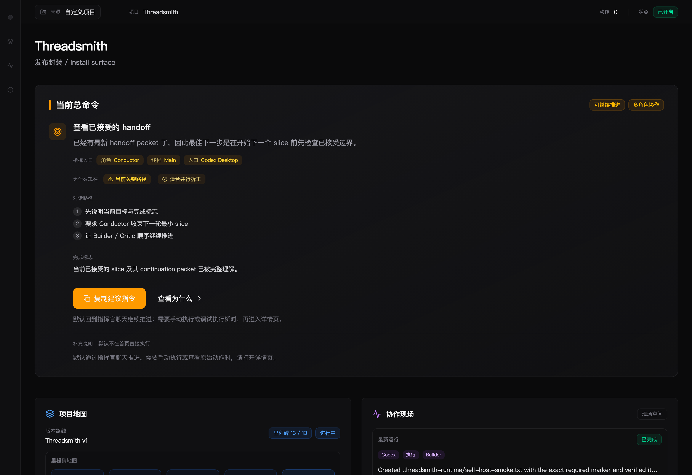
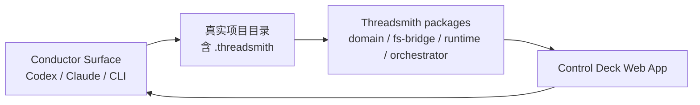

# Threadsmith

[](LICENSE)


> A control deck for AI coding projects.
> Keep project truth, workflow state, evidence, and acceptance in one place.

Threadsmith 是一个面向 AI coding workflow 的 **web control deck**。

它不替代你的主聊天面，也不假装自己是新的 AI IDE。当前公开主线里，它主要和 Codex Desktop、Codex CLI 这类 conductor surface 并排工作，专门把项目真相、推进状态、执行结果、证据和验收收口到一个独立界面里，让你在长任务、多轮推进、多角色协作时，始终知道项目现在到底走到了哪里。

如果你已经在用 vibe coding / agentic coding，Threadsmith 主要帮你回答这几个问题：

- 当前项目真正的目标和阶段目标是什么
- 为什么下一步是现在这一步
- 最近一次执行到底产出了什么
- 验收究竟卡在哪一关
- 哪些内容已经写回 truth，哪些还只是线程里的话

它尤其适合这些场景：

- 主聊天线程越来越长，项目状态越来越难讲清
- 多线程 / 多角色推进后，不知道谁在做什么
- agent 说“做完了”，但你不确定结果有没有真正落到项目 truth
- 到验收时才发现一堆当时没暴露出来的问题

当前版本：`v0.1.1`

## Features

- **Project front door**: choose a real project before diving into the deck.
- **Truth-first workflow**: read and write `.threadsmith` project truth instead of relying on a long chat thread.
- **Single-screen supervision**: see command, roadmap, judgement, collaboration, and acceptance without hunting through logs.
- **Evidence and acceptance workbenches**: inspect what was actually run, verified, accepted, or still blocked.
- **Codex-only release lane**: stable default routing for Codex Desktop / Codex CLI based workflows, with provider-routing truth prepared for later expansion.
- **Local-first web app**: run it against your own project folder; no hosted backend is required for the current release.

- Changelog: [CHANGELOG.md](CHANGELOG.md)
- Release notes: [docs/releases/threadsmith-v0.1.1.md](docs/releases/threadsmith-v0.1.1.md)
- Release checklist: [docs/checklists/release-v0.1.1.md](docs/checklists/release-v0.1.1.md)
- Release copy: [docs/marketing/github-release-v0.1.1.md](docs/marketing/github-release-v0.1.1.md)
- Social post draft: [docs/marketing/social-post-draft.md](docs/marketing/social-post-draft.md)
- Public sync strategy: [docs/releases/public-sync-strategy.md](docs/releases/public-sync-strategy.md)
- Usage and LLM configuration: [docs/guides/usage-and-llm-configuration.md](docs/guides/usage-and-llm-configuration.md)
- Truth boundary: [docs/architecture/threadsmith-truth-boundary.md](docs/architecture/threadsmith-truth-boundary.md)



## Share / Demo

- Screenshot: [docs/assets/threadsmith-open-source-surface.png](docs/assets/threadsmith-open-source-surface.png)
- GitHub Release copy: [docs/marketing/github-release-v0.1.1.md](docs/marketing/github-release-v0.1.1.md)
- Social post draft: [docs/marketing/social-post-draft.md](docs/marketing/social-post-draft.md)

## 它解决什么问题

当 AI coding 进入长任务、多轮推进、多个角色协作时，主聊天线程往往会越来越难回答这些问题：

- 当前真正的项目目标和阶段目标是什么
- 下一步为什么是现在这一步
- 最近一次执行到底产出了什么
- 验收卡在哪一关
- 哪些结论已经写回 truth，哪些还只是线程里的话

Threadsmith 把这些信息拆成一个独立的 control deck，让主聊天面继续负责“对话与指挥”，而让监督界面负责“看清真相与流程”。

## 当前 V0.1 表面

目前仓库已经收口到一条可真实运行的 web app 路径，包含：

- Threadsmith 前门：先决定今天进入哪个真实项目
- 自定义项目接入：连接真实项目目录，必要时初始化最小 `.threadsmith`
- 首页监督界面：当前总命令、项目地图、推进判断、协作现场、验收雷达
- 侧边工作台：项目、阶段、证据、验收
- install surface：安装 / 固定 / 日常打开方式说明
- first-run onboarding：首次使用、初始化、设为默认进入、修复恢复路径
- `Codex-only` 默认路由：`planner / executor / reviewer / verifier / closeout` 当前默认都由 Codex 承担，主 conductor surface 默认是 `Codex Desktop`

## 快速开始

### 1. 环境要求

- Node.js `22+`
- npm `11+`

### 2. 安装依赖

如果你是从 GitHub 第一次拉取：

```bash
git clone https://github.com/Teddy-creator/Threadsmith-control-deck.git
cd Threadsmith-control-deck
```

```bash
npm ci
```

### 3. 所有平台先跑起来

这条路径适合 macOS、Windows 和 Linux：

```bash
npm run start
```

然后打开：

```text
http://127.0.0.1:5173/?appHome=1
```

这里会进入 Threadsmith 前门。第一次使用时，建议先在页面里连接真实项目，再初始化或查看该项目的 `.threadsmith` truth。

如果你还没有真实项目可连，可以先打开 `项目与来源` 里的 demo mode：

- `Demo：已收口项目` 展示一条已经完成验收、closeout 和 handoff 的项目线
- `Demo：过期交接点` 展示 truth 已更新但 handoff packet 落后的风险态

Demo mode 只用于学习页面含义；正式工作时，请连接你的真实项目目录。

如果 `5173` 被占用，可以用 Vite 参数换端口：

```bash
npm run dev --workspace @threadsmith/control-deck -- --host 127.0.0.1 --port 5174
```

然后打开：

```text
http://127.0.0.1:5174/?appHome=1
```

### 4. macOS 快捷入口

```bash
./Launch-Threadsmith.command
```

如果没有显式项目参数，这个命令会遵循你在 Threadsmith 里保存的 `日常打开方式`。第一次上手或想先决定今天从哪条线进入时，优先用下面这个 Threadsmith 前门更直观。

### 5. 作为“产品前门”打开

```bash
./Open-Threadsmith-App.command
```

这会先进入 Threadsmith 前门，再从前门决定今天进入哪个真实项目。

### 6. macOS 显式直达某个项目

```bash
./Launch-Threadsmith.command "/path/to/your-project"
```

也可以使用环境变量：

```bash
THREADSMITH_PROJECT_ROOT="/path/to/your-project" ./Launch-Threadsmith.command
```

Windows / Linux 用户可以先用 `npm run start` 打开前门，再在页面里输入真实项目根目录。

## 典型使用路径

推荐日常路径：

1. 用 `Open-Threadsmith-App.command` 打开前门
2. 在 `项目与来源` 里确认今天要进入的真实项目
3. 需要时把当前项目设成 `默认进入`
4. 在首页和侧边工作台里确认真相、证据和下一步
5. 回到 `Codex Desktop`、`Codex CLI` 等 conductor surface 继续主要开发对话

如果你已经明确知道这轮只做某个项目，也可以直接使用：

```bash
./Launch-Threadsmith.command "/path/to/your-project"
```

## 第一次连接真实项目

进入后优先看 `项目与来源` 工作台：

- 如果是第一次使用，先看 `首次上手引导`
- 如果当前还是示例来源，切换到 `自定义项目`
- 输入项目根目录并点击 `连接项目`

如果项目还没有 `.threadsmith`：

- 点击 `初始化 Threadsmith`
- Threadsmith 会创建最小状态文件
- 初始化完成后，再回到该项目继续推进

## Threadsmith 怎么工作

Threadsmith 的核心边界是：

- 主聊天面负责对话、指挥和代码推进
- Threadsmith 负责监督、展示、解释和对齐 truth



更具体地说：

- `.threadsmith` 保存项目真相、阶段、验收、事件和运行记录
- `packages/domain` 定义状态对象和 schema
- `packages/fs-bridge` 负责读写项目 truth
- `packages/runtime` 负责把底层 truth 组装成可展示的监督状态
- `packages/orchestrator` 负责自动执行桥接与运行编排
- `apps/control-deck` 提供你实际看到的 UI

## 当前默认路由

当前 `v0.1.1` 的公开可交付主线仍然是 `Codex-only`：

- `planner / executor / reviewer / verifier / closeout` 的默认 provider 都是 `codex`
- 主 conductor surface 的默认值是 `codex-desktop`
- 当前自动执行桥真正稳定支持的是 `Codex` 路径，尤其是 executor run
- 项目工作台里的 provider routing 主要用于把项目当前 truth 讲清楚，并为后续扩展预留；它不代表 `multi-provider` 已经是 `v0.1.1` 的交付承诺

## Codex / `$threadsmith` 接入边界

Threadsmith 的页面负责显示和配置，真正的主对话仍然发生在你的 conductor surface，例如 Codex Desktop 或 Codex CLI。

如果你安装了 Codex skill，可以在重要边界显式调用 `$threadsmith`：

```text
使用 $threadsmith，更新当前项目状态，不开始实现，只同步 truth 并汇报 current phase / acceptance / next best step。
```

或者：

```text
使用 $threadsmith，按当前 Project Brief / Current Phase / Acceptance State 推进下一刀。
```

不需要每句话都调用 `$threadsmith`。更推荐在阶段开始、阶段结束、验收变化、方向改变、发现 blocker、closeout 或准备提交时写回 `.threadsmith`。

## 状态刷新与 truth 来源

Threadsmith 会自动轮询当前项目，也可以用顶部的 `刷新状态` 立即重读 `.threadsmith`。

如果页面看起来没更新，优先检查三件事：

- 顶部显示的项目是否是你真正想看的项目
- `刷新状态` 后的上次读取时间是否变化
- conductor 是否已经把新的 phase、acceptance、run 或 evidence 写回 `.threadsmith`

页面不会凭空知道聊天线程里的临时讨论。只有写回项目 truth 的内容，才会稳定出现在 control deck 里。

如果你没有安装 skill，Threadsmith 仍然可以作为本地 control deck 使用：连接项目、初始化 `.threadsmith`、查看 truth、刷新状态、检查证据和验收位置。只是 AI conductor 不会自动帮你写回每次任务边界。

## 仓库结构

```text
apps/control-deck/   Web control deck 与本地 bridge server
packages/domain/     共享 schema 与核心状态对象
packages/runtime/    监督状态推导与 UI-facing selectors
packages/fs-bridge/  .threadsmith 文件读写与 truth bridge
packages/orchestrator/ 自动执行与 bridge 编排
examples/            示例项目状态
tests/               E2E 与 smoke tests
docs/                面向用户和发布的文档
```

## 开发与验证

常用命令：

```bash
npm run start
npm run dev
npm run test
npm run build
npm run test:e2e
npm run verify:release
npm run smoke:self-host
```

默认的 `npm run smoke:self-host` 会先把当前仓库的 committed truth 快照复制到隔离的 runtime workspace，再在那里跑一轮真实 executor smoke，这样不会默认把主仓库 `.threadsmith` 的 committed truth 再弄脏。

如果你想显式对当前项目根目录运行 smoke，可使用：

```bash
npm run smoke:self-host -- .
```

如果你只想打开产品面而不是进入纯开发模式，也可以继续使用：

```bash
./Launch-Threadsmith.command
./Open-Threadsmith-App.command
```

## 产品边界

Threadsmith 当前优先是一个可长期使用、可安装、可公开发布的 web control deck。

V0.1 明确不追求：

- 原生桌面壳
- 完整替代主聊天入口
- 在这一步就覆盖所有 provider 的全自动执行
- 把 provider routing 界面误读成“非 Codex provider 已正式可用”

## 贡献

欢迎围绕以下方向贡献：

- workflow 监督与 truth surface
- onboarding / install / repo surface
- execution bridge、route truth 与 operator guidance
- tests、smoke、release hygiene

## 开源入口

如果你想参与反馈或提交改动，优先使用仓库里的标准入口：

- 提交 bug：Issues 里的 `Bug report`
- 提需求：Issues 里的 `Feature request`
- 发 PR：仓库里的 Pull Request template
- 涉及安全问题：优先查看 [SECURITY.md](SECURITY.md)

如果你只是想先看 Threadsmith 是否适合自己，最直接的方式还是先读 README、再跑一次 `Launch-Threadsmith.command` 或 `Open-Threadsmith-App.command`。

参与方式见 [CONTRIBUTING.md](CONTRIBUTING.md)。

## License

本仓库采用 [MIT License](LICENSE)。
